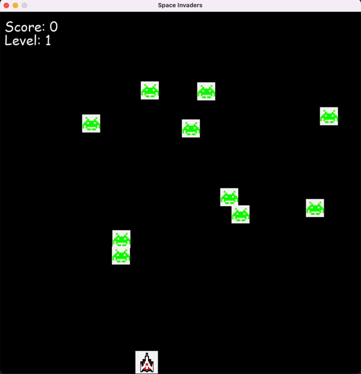

# Space Invader Game
This is a simple Space Invader game built with Python and tkinter. The game is inspired by the classic arcade game Space Invaders.

## Requirements
To run this game, you need to have Python 3.x installed on your machine. You can download Python from the official website: https://www.python.org/downloads/

You also need to have the tkinter module installed, which should come pre-installed with Python 3.x. If for some reason you don't have it, you can install it using pip:

```
pip install tk
```

## How to Play
To play the game, run the `space_invader.py` file using Python:

```
python space_invader.py
```
- When the game starts, you will see the player's spaceship at the bottom of the screen. Use the arrow keys to move the spaceship left and right, and press the spacebar to shoot lasers at the incoming aliens. Your goal is to shoot down all the aliens before they reach the bottom of the screen.

- If an alien reaches the bottom of the screen, you lose a life. You have three lives in total, and the game ends when you run out of lives or when you shoot down all the aliens.

- The game includes three levels of difficulty: easy, medium, and hard. You can select your desired difficulty level from the main menu before starting the game.

## Features
- Simple user interface
- Three levels of difficulty
- Sound effects
- Multiple lives for the player
- Increasing difficulty as the game progresses

Here is the demo: 

